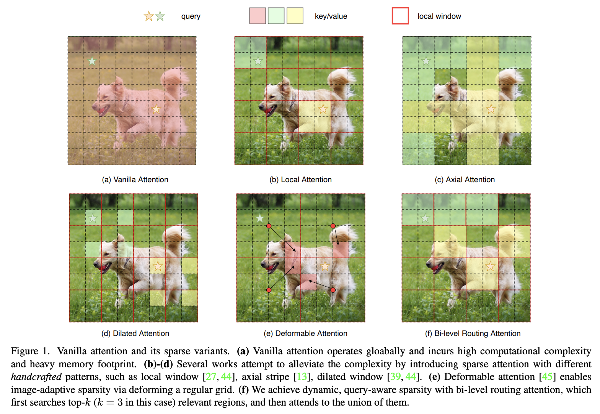

# [BiFormer: Vision Transformer with Bi-Level Routing Attention](https://arxiv.org/abs/2303.08810)

Official PyTorch implementation of **BiFormer**, from the following paper:

[BiFormer: Vision Transformer with Bi-Level Routing Attention](https://arxiv.org/abs/2303.08810). CVPR 2023.\
[Lei Zhu](https://github.com/rayleizhu), [Xinjiang Wang](https://scholar.google.com/citations?user=q4lnWaoAAAAJ&hl=en), [Zhanghan Ke](https://zhke.io/), [Wayne Zhang](http://www.statfe.com/), and [Rynson Lau](https://www.cs.cityu.edu.hk/~rynson/)

--- 
<p align="left">

</p>


<!-- ✅ ⬜️  -->

## News

* 2023-04-11: [object detection code](./object_detection/) is released. It achives significantly better results than the paper reported due to a bug fix.

* 2023-03-24: For better memory and computation efficieny, we are diving into the optimization of BRA with CUDA. Please stay tuned.
  - Collaborations and contributions are welcome, especially if you are an expert in CUDA/[cutlass](https://github.com/NVIDIA/cutlass). There is a chance to co-author a paper.

* 2023-03-24: For better readability, BRA and BiFormer-STL has been refactored. See [ops/bra_nchw.py](ops/bra_nchw.py) and [models/biformer_stl_nchw.py](models/biformer_stl_nchw.py). We still keep the [legacy (and a little bit messy) implementation](ops/bra_legacy.py) for compatiability of previously released checkpoints.

## Results and Pre-trained Models

### ImageNet-1K trained models

| name | resolution |acc@1 | #params | FLOPs | model | log | tensorboard log<sup>*</sup> |
|:---:|:---:|:---:|:---:| :---:|:---:|:---:| :---:| 
| BiFormer-T | 224x224 | 81.4 | 13.1 M | 2.2 G | [model](https://api.onedrive.com/v1.0/shares/s!AkBbczdRlZvChHEOoGkgwgQzEDlM/root/content) | [log](https://1drv.ms/t/s!AkBbczdRlZvChHNvg1b_QV_Ptw_T?e=Tbuf4l) | - |
| BiFormer-S | 224x224 | 83.8 | 25.5 M | 4.5 G | [model](https://api.onedrive.com/v1.0/shares/s!AkBbczdRlZvChHDyM-x9KWRBZ832/root/content) | [log](https://1drv.ms/t/s!AkBbczdRlZvChHQKrsNAo0PCpgWz?e=k7V8xX) |[tensorboard.dev](https://tensorboard.dev/experiment/VQAZonmIRjasGaVDPloM5Q/#scalars) |
| BiFormer-B | 224x224 | 84.3 | 56.8 M | 9.8 G | [model](https://api.onedrive.com/v1.0/shares/s!AkBbczdRlZvChHI_XPhoadjaNxtO/root/content) | [log](https://1drv.ms/t/s!AkBbczdRlZvChHWq2YS_Iwryhf1g?e=GWiMy9) | - |
| BiFormer-STL | 224x224 | 82.7 | 28.4 M | 4.6 G | [model](https://api.onedrive.com/v1.0/shares/s!AkBbczdRlZvChSf-m7ujkvx9lIQ1/root/content) | [log](https://1drv.ms/t/s!AkBbczdRlZvChSYWxeM5EmrC7-TN?e=W1q15P) | - |
| BiFormer-STL-nchw | 224x224 | 82.7 | 28.4 M | 4.6 G | [model](https://api.onedrive.com/v1.0/shares/s!AkBbczdRlZvChWYrKbWbMgqd2Ai0/root/content) | [log](https://1drv.ms/t/s!AkBbczdRlZvChWf_axjI80DMWy4X?e=uni4Z2) | [tensorboard.dev](https://tensorboard.dev/experiment/CD2QfxOYT6WQ05qnpWdK5A/#scalars&_smoothingWeight=0&tagFilter=acc) |

<font size=1>* : reproduced after the acceptance of our paper.</font>

Here the `BiFormer-STL`(**S**win-**T**iny-**L**ayout) model is used in our ablation study. We hope it provides a good start proint for developing your own awsome attention mechanisms.

All files can be accessed from [onedrive](https://1drv.ms/u/s!AkBbczdRlZvChGsXFqAA-PVnA-R8?e=IPlOCG).

## Installation
Please check [INSTALL.md](INSTALL.md) for installation instructions. 

## Evaluation

We did evaluation on a slurm cluster environment, using the command below:

```bash
python hydra_main.py \
    data_path=./data/in1k input_size=224  batch_size=128 dist_eval=true \
    +slurm=${CLUSTER_ID} slurm.nodes=1 slurm.ngpus=8 \
    eval=true load_release=true model='biformer_small'
```

To test on a local machine, you may try

```bash
python -m torch.distributed.launch --nproc_per_node=8 main.py \
  --data_path ./data/in1k --input_size 224 --batch_size 128 --dist_eval \
  --eval --load_release --model biformer_small
```

This should give 
```
* Acc@1 83.754 Acc@5 96.638 loss 0.869
Accuracy of the network on the 50000 test images: 83.8%
```

**Note**: By setting `load_release=true`, the released checkpoints will be automatically downloaded, so you do not need to download manually in advance.

## Training

To launch training on a slurm cluster, use the command below:

```bash
python hydra_main.py \
    data_path=./data/in1k input_size=224  batch_size=128 dist_eval=true \
    +slurm=${CLUSTER_ID} slurm.nodes=1 slurm.ngpus=8 \
    model='biformer_small'  drop_path=0.15 lr=5e-4
```

**Note**: Our codebase automatically generates output directory for experiment logs and checkpoints, according to the passed arguments. For example, the command above will produce an output directory like

```
$ tree -L 3 outputs/ 
outputs/
└── cls
    └── batch_size.128-drop_path.0.15-input_size.224-lr.5e-4-model.biformer_small-slurm.ngpus.8-slurm.nodes.2
        └── 20230307-21:33:26
```

## Acknowledgement
This repository is built using the [timm](https://github.com/rwightman/pytorch-image-models) library, and [ConvNext](https://github.com/facebookresearch/ConvNeXt), [UniFormer](https://github.com/Sense-X/UniFormer) repositories.

## License
This project is released under the MIT license. Please see the [LICENSE](LICENSE) file for more information.

## Citation
If you find this repository helpful, please consider citing:
```bibtex
@Article{zhu2023biformer,
  author  = {Lei Zhu and Xinjiang Wang and Zhanghan Ke and Wayne Zhang and Rynson Lau},
  title   = {BiFormer: Vision Transformer with Bi-Level Routing Attention},
  journal = {Proceedings of the IEEE/CVF Conference on Computer Vision and Pattern Recognition (CVPR)},
  year    = {2023},
}
```

## TODOs
- [x] Add camera-ready paper link
- [x] IN1k standard training code, log, and pretrained checkpoints
- [ ] IN1k token-labeling code
- [x] Semantic segmentation code
- [x] Object detection code
- [x] Swin-Tiny-Layout (STL) models
- [x] Refactor BRA and BiFormer code
- [ ] Visualization demo 
- [x] ~~More efficient implementation with triton~~. See [triton issue #1279](https://github.com/openai/triton/issues/1279)
- [ ] More efficient implementation (fusing gather and attention) with CUDA
